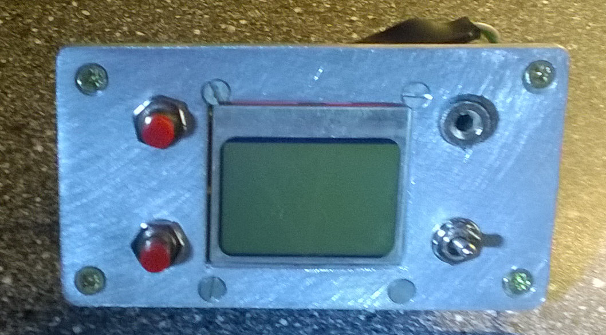
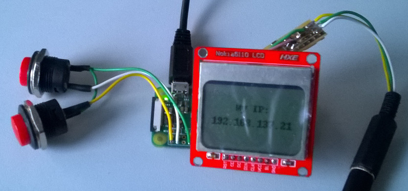
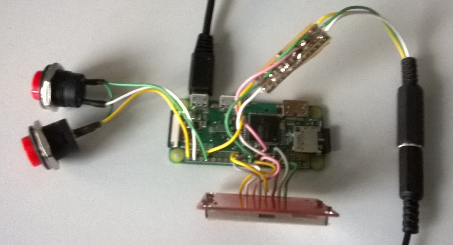
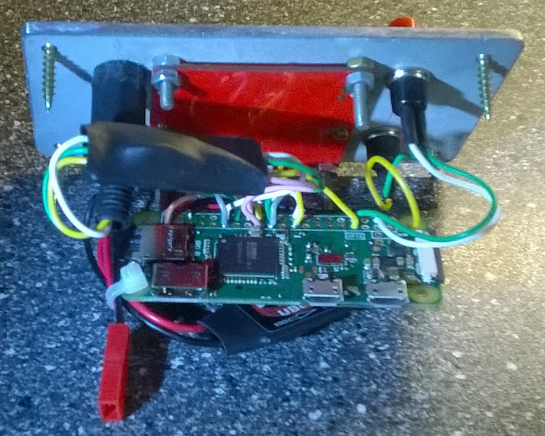

# rpi_radio
Description: Raspberry PI zero based web radio receiver with Nokia 5110 display.

## create headless rasbian image for rpi zero
  - flash raspbian sketch lite (https://www.raspberrypi.org/downloads/raspbian/) to SD card
  - setup ssh on startup (create file "ssh" on /boot section)
  - setup wifi on startup https://raspberrypi.stackexchange.com/questions/10251/prepare-sd-card-for-wifi-on-headless-pi
  
### example wifi setup file (put to /boot/wpa_supplicant.conf for bootup setup)

    ctrl_interface=DIR=/var/run/wpa_supplicant GROUP=netdev
    update_config=1
    country=cz
    
    network={
        ssid="mySSID"
        psk="myPASSWORD"
        key_mgmt=WPA-PSK
    }
    
## connect with ssh and run raspi-config
  - sudo raspi-config
  - set interfacing options / ssh enabled (pernamently - not by ssh file in boot)
  - change password but don't forget it
  - upgrade system (sudo apt-get update; sudo apt-get upgrade)

## wire up Nokia 5110 display, test
  - https://www.algissalys.com/how-to/nokia-5110-lcd-on-raspberry-pi
  - backlight on pin 17, test: https://pythonprogramming.net/gpio-example-raspberry-pi/
  - install lcd libraries for python3 too (to run examples with python3)
    - sudo apt-get install python3-pip python3-pil
    - sudo pip3 install RPi.GPIO
    - test: python3 shapes.py

## solder and test audio filter
  - source 1: https://learn.adafruit.com/introducing-the-raspberry-pi-zero/audio-outputs
  - source 2: https://www.raspberrypi.org/forums/viewtopic?f=91&t=86609 (Gordon, Wed Sep 10, 2014 12:23 pm)
  - source 3 (test): https://www.raspberrypi.org/documentation/usage/audio/

### solder audio filter

  - connect 3V3 and GND to rpi header
  - PWM0 to GPIO18
  - PWM1 to GPIO13

### install pinout blob

    sudo apt-get install device_tree_compiler
    dtc -O dtb -o dt-blob.bin dt-blob.dts
    sudo cp dt-blob.bin /boot

### test audio ouput

    sudo apt-get install omxplayer
    wget http://rpf.io/lamp3 -O example.mp3 --no-check-certificate
    omxplayer example.mp3

  - it makes noise :-D
  
## install mpd and mpc, add streams, play internet radio

    sudo apt-get install mpd mpd
    mpc add http://icecast7.play.cz/cro1-128.mp3
    mpc add http://icecast2.play.cz/radiobeat128.mp3
    mpc add http://212.111.2.151:8000/rockmax_128.mp3
    mpc add http://212.111.2.151:8000/rm_hard_128.mp3
    mpc play 2
    mpc volume 100

## clone repo, run application at startup

    git clone https://github.com/ondrejh/rpi_radio.git
    cd rpi_radio
    sudo cp radio.service /lib/systemd/system/
    sudo chmod 644 /lib/systemd/system/radio.service
    sudo systemctl daemon-reload
    sudo systemctl enable radio.service
    sudo reboot

## wire and test buttons
  - wire button switches between GPIO 20, 21 and GND
  - test it with buttons.py

## guts

## todo
  - test interface for display (to try without HW)
  - add navigation

